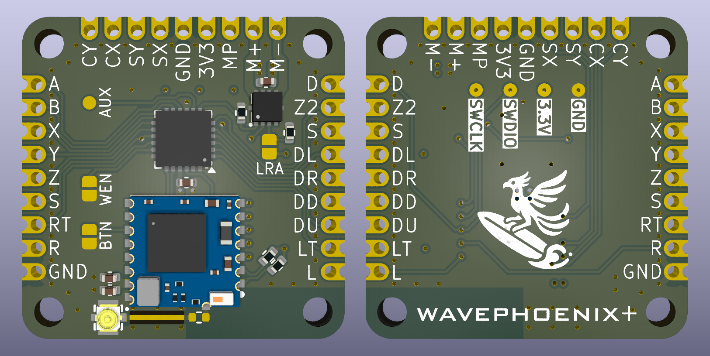
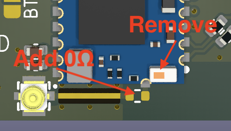

# WavePhoenix+

> [!IMPORTANT]  
> This is beta hardware! You'll need a copy of the WavePhoenix+ firmware from loopj to use this board, which is not yet publicly available.

The WavePhoenix+ is a custom PCB which allows you to add WaveBird support to portable Wii/GameCube consoles. It is footprint compatible with the 4Layer Technologies [GC+ 2.0](https://4layertech.com/products/gc-2) board, and emulates both a physical GameCube controller, as well as a WaveBird receiver.

## Features

- Footprint compatible with [GC+ 2](https://4layertech.com/products/gc-2)
- Captures digital/analog inputs from connected buttons, sticks, and triggers
- Captures wireless inputs from a WaveBird controller
- Support for both ERM and LRA rumble motors
- Pad to enable/disable wireless support, eg. to enable wireless only when docked
- Optional external antenna support
- Firmware updatable via Bluetooth

## Flashing Firmware

Both the WavePhoenix bootloader, and WavePhoenix+ firmware will need to be flashed to the board before it can be used. The back of the board has a set of 0.1" (2.54mm) pitch pads for flashing the bootloader via SWD.

I use a [handheld pogo flashing adapter](https://www.aliexpress.us/item/3256805545980544.html) for this, but you can also temporarily hand solder wires to the pads if you don't want to buy an adapter.

See the [WavePhoenix flashing docs](https://github.com/loopj/wavephoenix/tree/main/hardware/mini-receiver#initial-firmware-flashing) for more information on flashing the bootloader.

## Pairing Controllers

Pairing controllers can be done by entering "pairing" mode. You can enter pairing mode by briefly bridging the `BTN` pads on the board, typically using a tact switch. Alternatively you can enter pairing mode from the WavePhoenix+ homebrew.

## Updating Firmware

Once the WavePhoenix+ firmware is initially flashed, it can only be flashed again once bootloader mode is entered. To enter bootloader mode, bridge the `BTN` pads on the board for more than 3 seconds. Alternatively, you can enter bootloader mode from the WavePhoenix+ homebrew.

## External Antenna

It can often be desirable to use an external antenna on builds.

To use an external antenna, you'll need to carefully remove the onboard chip antenna from the RF-BM-BG22C3 with hot air station or soldering iron. You'll then need to add a 0Ω resistor to bridge the antenna trace to the external antenna connector.

I'd recommend covering the nearby components with Kapton tape before attempting to remove the chip antenna with hot air.

You'll need to use a a 2.4GHz antenna with an IPEX MHF 4 (or compatible) connector.

## Rumble Motors

The board uses a DRV2603 haptic driver for rumble support, which supports both ERM and LRA rumble motors. The board is configured to use an ERM motor by default, but you can change this by bridging the `LRA` pad on the board.

## Enabling/Disabling Wireless

Wireless is disabled by default to allow for a lower power mode when in portable mode. To enable wireless, connect the top half of the `WEN` pads to `GND`.

For example, you may want to use either a physical switch or a GPIO to control the `WEN` pads, so that you can enable wireless when docked, and disable it when undocked.

The radio SoC uses very little power compared to a powered Wii/GameCube/N64 so it is often more convenient to just enable wireless permanently when the board is powered. To do this, simply bridge the `WEN` pad on the board.

## Connecting Buttons and Sticks

The pinout of the board is identical to the 4Layer Technologies GC+ 2.0 board.

## Limitations

This is a very specialist project, designed for use in portable Wii/GameCube/N64 consoles where having support for a wireless controller is desirable, such as "dockable" portables.

If you are building a portable where that is not a requirement, then you should buy a [GC+ 2.0](https://4layertech.com/products/gc-2) board from the fine folks at 4Layer Technologies instead.

The firmware currently does not support features such as dead zone configuration, setting stick limits, or other advanced controller options.

I will likely add support for configuring basic stick limits, and inverting stick axes via either the WavePhoenix+ homebrew, or a web browser Bluetooth UI in future.

## License

The firmware in this repository is licensed under the [MIT License](firmware/LICENSE).

The hardware is licensed under the [Solderpad Hardware License v2.1](hardware/LICENSE).
